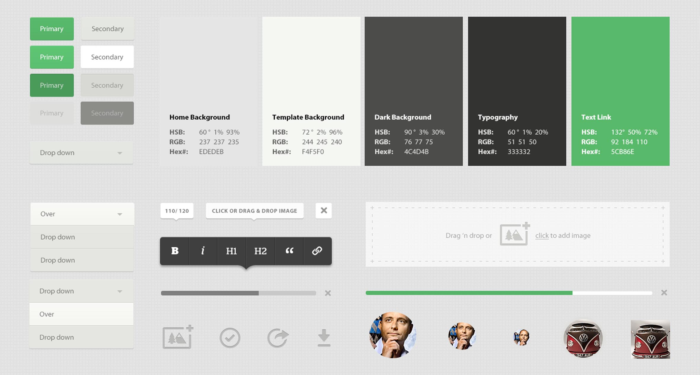

# Design Guidelines for HYF students

Even though they may be working on the same projects and products, developers and designers often work apart from one another in silos. Design is sometimes considered by developers as a secondary thing, unimportant when compared with the functionality of a product.

That kind of thinking can be detrimental to the developer-designer relationship at work. But that’s not all, not having design and usability in mind when working on projects or technical assignments can actually make it harder for you to actually find an internship or job, even when your code is great. Not having a basic grasp of design can hold you back in your career, but even if you are not interested in design, there are easy ways to go about it. 

There are plenty of reasons why you might want to learn design, or at least develop a basic foundation of design knowledge:

- First impressions matter! When you work on a technical assignment as an application to a job or internship, sometimes the first people to look at your work are recruiters and not developers! They (most likely) won’t be able to judge the quality of your code, but are able to judge its looks and usability. If the projects on your CV don't look good or are ‘hard to use’, your application might not pass the first check.

- Small teams might not always have a dedicated designer and you still should be able to work with for example just the company's design guidelines and/or general design defined by the company’s style.

- Learning about design and UX will make your work and passion projects better. If you don’t understand the basics of design you may overlook small details that make a user interface particularly user-friendly and unintentionally sabotage the project’s user experience. That would be a waste of your amazing code!

**Content on this repo:**
1. [Essential design principles]()
2. [The ‘art’ of ‘stealing’: a practical guide]()
3. Do’s and Don'ts with examples from HYF students (Coming Soon!)

In this guide we will provide you with some basic design theory and plenty of practical examples you can apply to your projects to ensure your applications and technical assignments look great. It won't help you think or work as a designer, but rather offer you insights and shortcuts so that you can do better in this area. Let’s then get started!

## Additional material
There are tons of resources online to help you become a better front end developer and designer. Besides the info shared in this repo, we recommend you take a look at the following resources:

- [Material.io](https://material.io/): Material is an adaptable system of guidelines, components, and tools that support the best practices of user interface design. Backed by open-source code and Google, Material streamlines collaboration between designers and developers, and helps teams quickly build beautiful products.
- [Frontend Practice](https://www.frontendpractice.com/) is a website to take your frontend skills to the next level by recreating real websites. Tip: If you build the websites there, you can also add them to your CV!
- [Frontend Mentor](https://www.frontendmentor.io) helps you improve your front-end coding skills by building real HTML, CSS and JavaScript projects
- [Figma](https://www.figma.com/ui-design-tool/): Figma is a free, online UI tool to create, collaborate, prototype, and handoff designs. Is very widely used among developers, designers and tech companies as a whole and mastering it will help you work better with designers.
- [Principles of design on InVision App](https://www.invisionapp.com/design-defined/principles-of-design/)
- [10 effective web design principles every designer should know](https://webflow.com/blog/web-design-principles)
