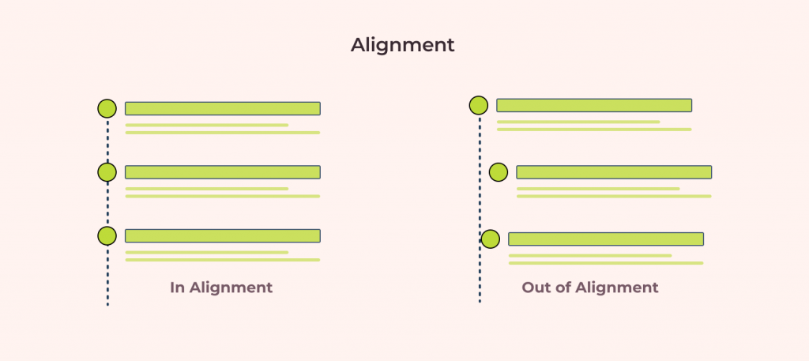
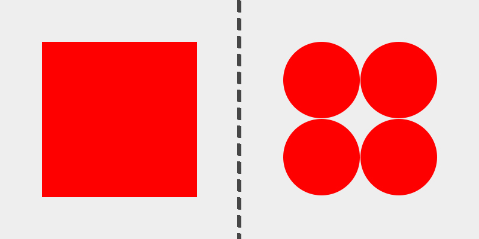

# 1. Essential design principles

Design principles are the key to understanding how design serves human needs for safety, meaning, achievement and beauty. Learn what these principles are and how they can help you design more welcoming, understandable, empowering and gratifying user experiences.

## A. Alignment and Hierarchy

Alignment is one of the most basic design principles. It refers to all of the text and graphical elements on a page or screen being lined up in a consistent fashion. A few common examples of alignment you probably know from using Word or Google Pages are left-justified, right-justified, or centered.

By aligning all of the elements on a page, you’re creating an invisible wall that makes the design consistent and provides a more easy-to-follow experience for the user. Grids are used to easily maintain consistency and alignment between elements.

Learn more about alignment and its importance in design in [this really cool article](https://ux360.design/alignment-principle-design/)

**Hierarchy** is a design concept that focuses on the arrangement of elements on a page in order to create a sense of importance between elements.

The human brain will naturally first look to elements that are larger, bolder, or more unique. When you’re designing your projects, pay careful attention to the way you use font sizes, the order of different elements, and their color/weight.

If you’re working on a UX/UI design project, think about the main action you want a user to take, and ensure that this element has a higher hierarchy on the page than the supporting copy. This could be accomplished by increasing the font size or weight of the most important element or by making it a more unique color than the rest of the elements on the screen.

We strongly recommend you take a look at the article [How to Use Visual Hierarchy and Alignment to Improve UI Design](https://balsamiq.com/learn/articles/visual-hierarchy-and-alignment/). Takes 5 minutes to read and it gives you a ton of useful data with graphic examples.

## B. Balance

Balance is a principle of design in which you create a page using an appropriate balance of symmetry and asymmetry, as well as positive and negative space, to ensure that no single element of the page overpowers any other element of the page.

If you have an unbalanced design, you risk letting a certain element of the design overpower the entire page, making the rest of the page fade into the background and lose purpose.

Symmetry of design is one way to create balance in a design. Think of a scale with equal weights on both sides, placed the same distance from the center.

On the opposite side of things, asymmetry can also be used to create a sense of balance. Using the same metaphor, consider a heavy weight on one side of a scale (but placed very close to the center) and a lighter weight on the other side (but placed much further from the center). As long as the weight and distribution of elements is consistent and doesn’t create too much visual tension, your design is still balanced.

In a project, for example, you might have a large single element on one side of the screen. If you just had one small element on the other side of the screen, the page would feel unbalanced to the eye. However, if you counter the one large element with a lot of smaller elements grouped together, you can still achieve a sense of balance, as the overall “weight” of the smaller elements will counterbalance the single larger element.

For more information on balance in design, read this [Introduction to Balance](https://uxengineer.com/principles-of-design/balance/)

## C. Contrast

Contrast is the usage of elements in a design that are inherently opposites so as to create a sense of visual interests and excitement.

For textures on your page, this could be smooth and rough textures. For colors, it could be light and dark shades. Contrast is crucial if you want your designs to be interesting for a user to interact with!

Additionally, contrast is an important design principle for ensuring the web is accessible to those with low vision or color blindness. By ensuring there is enough contrast between your text and whatever is behind it on your site will be more accessible for all sighted users. 

Read [How To Use Contrast in Web Design: Tips and Examples](https://elementor.com/blog/contrast-web-design/) for more information on contrast.

## D. Color

The usage of colors is one of the most important aspects of a strong design. Color, when used effectively, can instantly cause someone to feel a specific emotion or think of a certain brand.

It’s almost just as important when choosing colors not to use too many colors. Try to keep your design to two primary colors and two secondary colors. When possible, use colors that all work synonymously with each other. Check out [this amazing tool](https://coolors.co/) you can use to create pleasing color palettes for your projects.

Check [“Color theory: a beginner's guide for designers”](https://webflow.com/blog/color-theory) to learn more about color and [“Choosing colors for web design: A practical UI color application guide”](https://dribbble.com/stories/2018/12/19/choosing-colors-for-web-design-a-practical-ui-color-application-guide)

## E. Typography 

Typography is another important element to consider when designing any project. Typography can be used to create a variety of different feelings in a user and can subconsciously inform them about the nature of your product.

If you’re designing a B2B (Business to Business) app for a large corporation, you might use a simple sans-serif font so that your typography matches the corporate nature of the actual product and doesn’t distract from the functions of the app. And if you’re designing a playful interactive website, you might use a looser serif font to capture that whimsy.

Think about the feeling you want users to have when using your product when choosing your typography. You should remember to consider consistency when choosing fonts. Try not to use more than two unique fonts for any specific project, so as not to overstimulate users and cause visual confusion. Google Fonts is an incredible tool for finding free web fonts.

IMAGE ABOVE: Use of Serif and Sans-serif fonts for known tech companies has changed over the years.

Your choice of typeface can have a significant impact on the look and feel of a logo or website design, as well as helping to define the personality of the design in question. To learn more about typography, read these [10 Tips On Typography in Web Design](https://uxplanet.org/10-tips-on-typography-in-web-design-13a378f4aa0d)

## F. Spacing

After looking at typography, you can take a step back and examine the layout, or spacing, of your content. Movement and proximity are two design principles that relate to spacing.

**Movement** refers to how your eye moves through the page or the flow of the page. You can use movement to direct a user’s eye in order to tell a story, point to a main action item, or encourage them to scroll. This is done by structuring the content within individual components and then arranging those components to form the layout of the page. By paying attention to how your eye moves through content, you can help users know where to look as they scan the page.

Unlike books, which tend to have very linear structure, websites can be more creative with their layout—in literally endless ways. It is important to make sure you are intentional with how you layout content and do so in a way which guides users through your content as easily as possible.

Consider these three examples above. Which is the easiest to follow? The arrangement on the left draws your eye off the screen to the left due to how the image is positioned which makes it hard to find the button. In the center option, it’s easy to skip over the headline because the image is too large in comparison. On the right, the heading draws your attention first and the image is composed so that it points to the main action item—the button.

**White space** is a helpful tool for creating strong movement, but it’s easy to use too much or too little. Think about how you are using it to direct the user’s eye and divide your content. When used well, users won’t notice the whitespace itself but will be able to better focus on the content you are presenting. For example, you can use whitespace to separate content (instead of a colored box) which results in a less cluttered layout:

Left: Using a graphic element to separate content and aligning images in the center. 
Right: Using whitespace to separate content and aligning images on the left to let the whitespace flow better around groups of related content and create a cleaner layout.

Is also important to know that proximity establishes relationships. When objects are closer together, they are perceived as being related. By controlling spacing around elements, you can imply relationships between them. It can be helpful to create a system for spacing to help build consistency through repetition and avoid the use of random numbers. This system is based off the default browser font size (1rem or 16px) and uses distinct values that cover most scenarios:

IMAGE LEFT: A component with uneven spacing between elements. IMAGE RIGHT: A component that uses consistent spacing.

For more information on this, take a look at this [‘Introduction to White Space’](https://uxengineer.com/principles-of-design/white-space) article.

## G. Image quality:

We all know that good images make any website or design better and easier to read, why? Well because users like to see something visual (a picture, an icon, etc) over a massive block of text, because they relate better to an image compared to a paragraph of words.

And this is true for any type of reading material, and there is no exception for websites: High quality images make the content more interesting. When working on projects, be sure to always use good quality images and icons that adapt well to all devices.

When looking for beautiful background images for your websites and applications, we recommend you take a look at [Unsplash](https://unsplash.com/) and [Pexels](https://www.pexels.com/), two websites with thousands of free stock photos & videos shared by talented creators. For great Icon packs, check this [20 Best Free Icon Packs](https://www.wix.com/blog/creative/2020/02/free-icon-packs/).

To learn more about image quality, read [Optimizing Images for Web: A Practical Guide](https://www.abetterlemonadestand.com/optimizing-images-for-web/)

***Now that we have a general idea of the essential design principles, it’s time to put them to practice!*** [Click here](practical_guide.md) to take a look at a practical guide we’ve put together to help you build applications based on other company’s designs!

