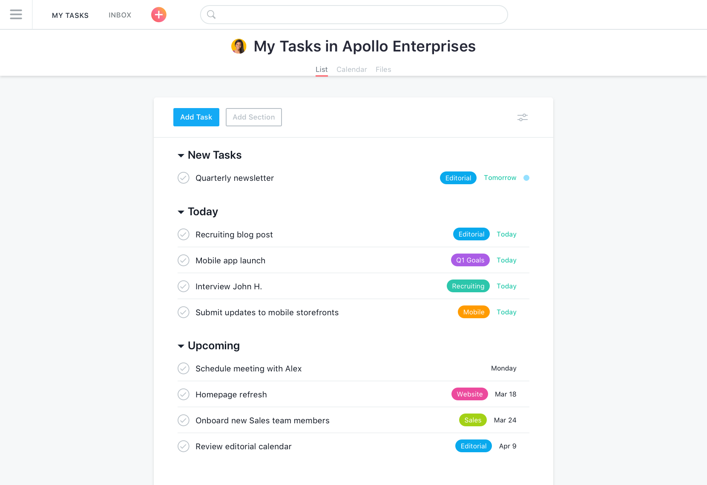
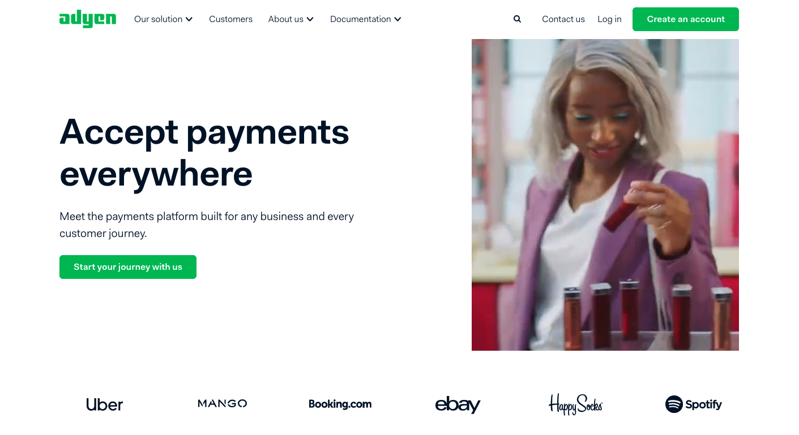
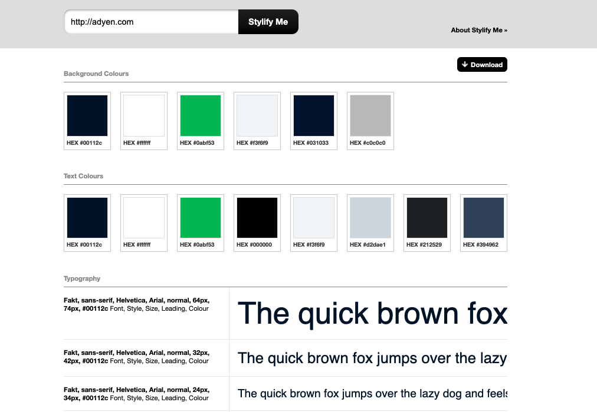
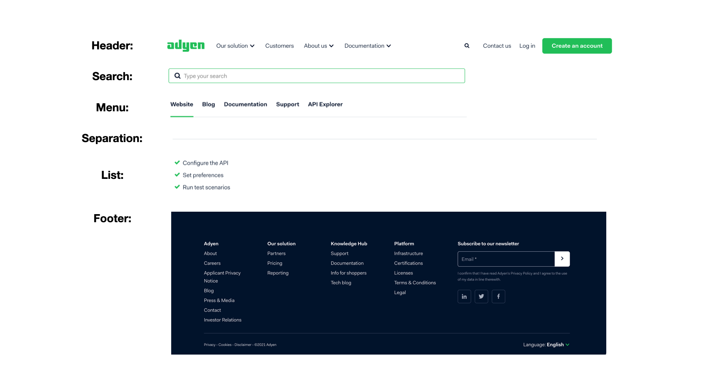
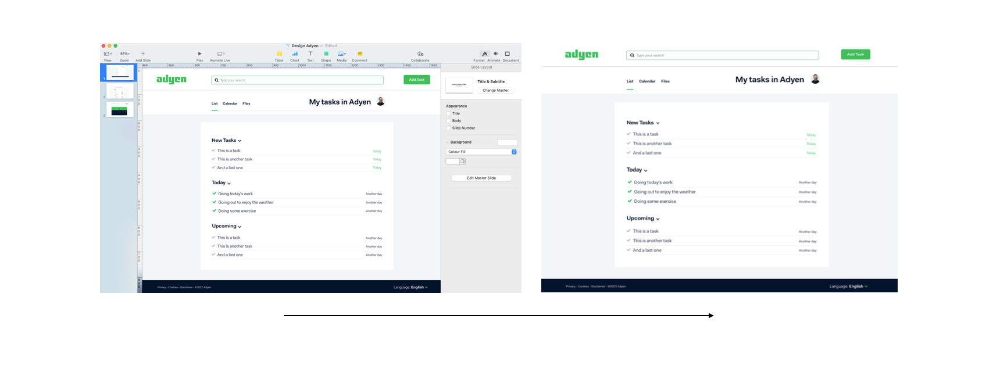
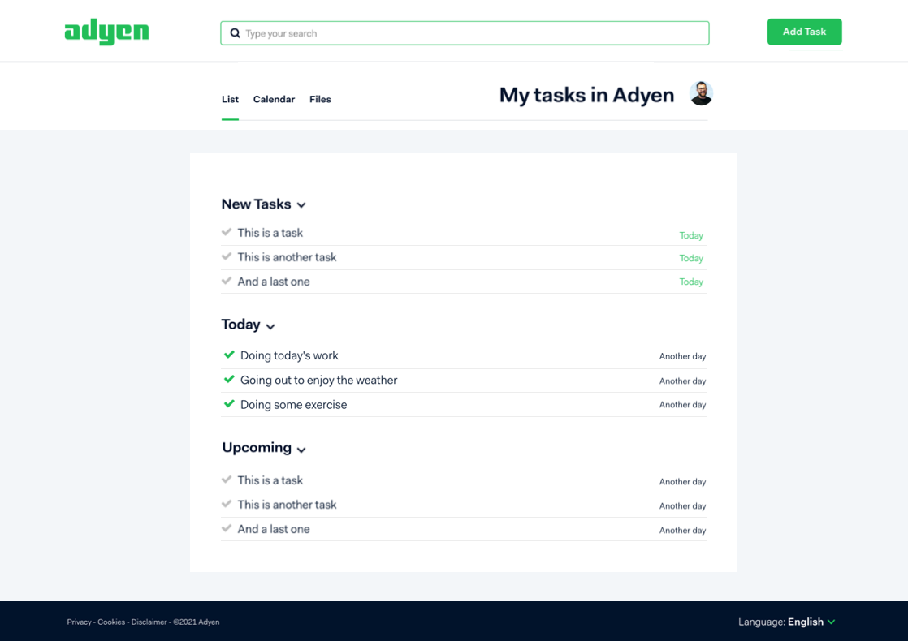
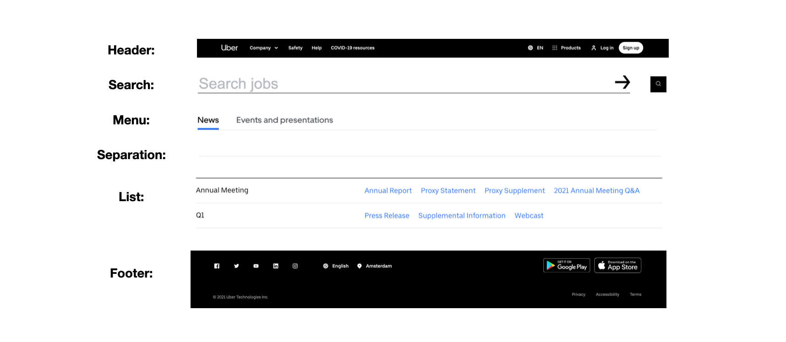
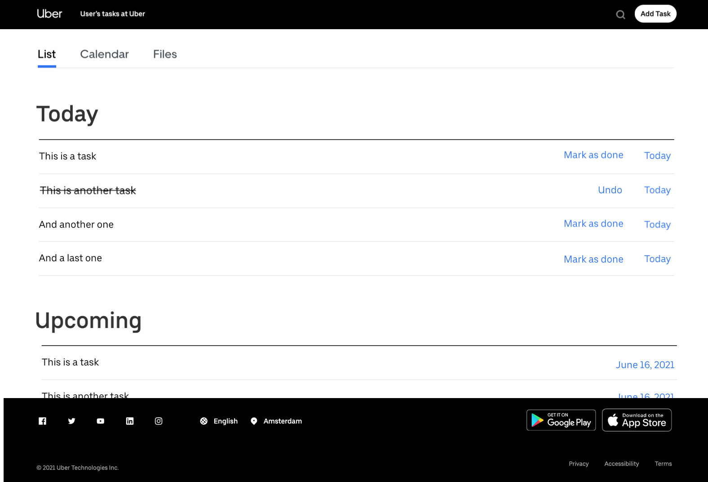
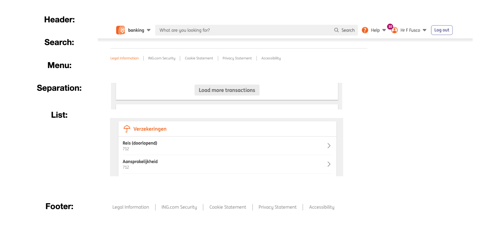
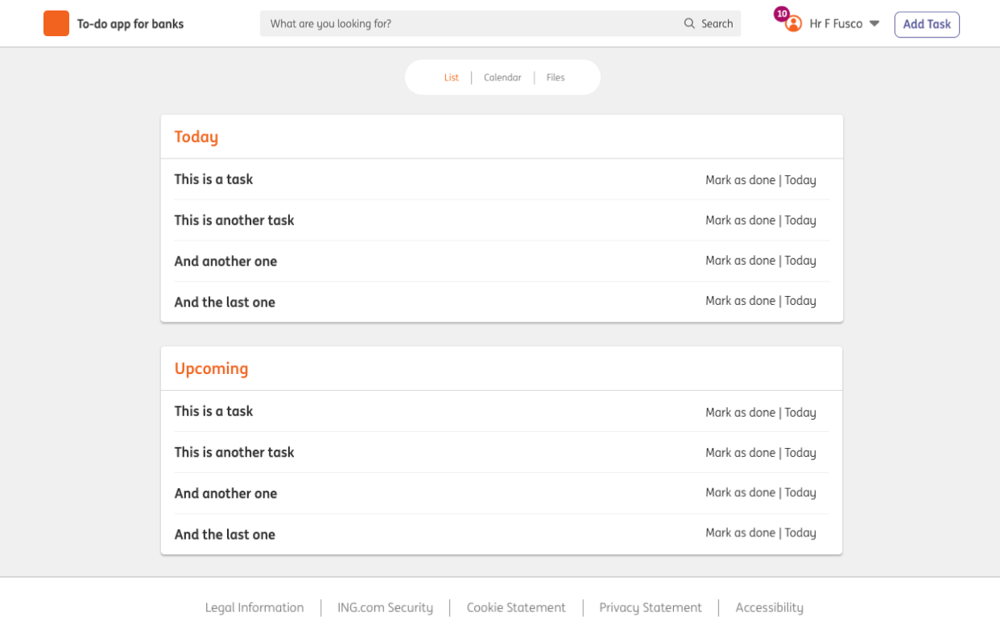

# 2. The ‘art’ of ‘stealing’: a practical guide

One of the best ways to learn about design is to try to recreate the work of others who are really good at it. Picking apart what works and what doesn’t, and figuring out why a particular design is appealing is one of the most valuable skills you can learn. 

Painter Pablo Picasso once said, “Good artists copy. Great artists steal.” This has never been more true than today. In fact, interactive design has a lot in common with the open-source software community—where you can find tons of code examples and tutorials which you can mix, match and tweak to end up with your desired functionality. [Dribbble.com](https://dribbble.com/), a social networking platform for digital designers and creatives is a great example of this. There you can look for and browse 1000s of designs for websites, apps and more and in many cases, download them!

In this practical guide, we will create the design for a simple to-do list application based on the house style from 3 different known companies: Adyen, Uber and ING. We want to show you how, without knowing much about design, you can apply the principles learned before to create apps and websites that look great. Let’s get started!

## A. Building a to-do app for Adyen

First thing you should do when building a design is to look at the requirements of what you are trying to build and understand what kind of elements should be included in it. For this example we will keep it easy. We will need:
- A (branded) header with a menu and a search bar
- Button to add tasks (and possibility to remove them)
- Displayed list of tasks

Searching online for a “to-do app graphic interface”, I landed on [Asana's website](https://asana.com/uses/to-do-list), a very know productivity app that offers (among other things) a todo-app that looks like this:

This is a great reference, but it looks nothing like Adyen’s brand. For that, we will have to make some changes here and there. Let’s get started by looking at [Adyen’s website](https://www.adyen.com/).

At the first fold of the site, we can see the colors they use, the fonts, the buttons, the search function, the spacing and alignment...Basically everything we need for our app!

***TIPS:*** You can inspect the page on your browser to find the exact typography, the colors, etc. Another practical way to do this is to use [stylifyme.com/](http://stylifyme.com/), a tool which basically gives you all the info you need in no time:

Browsing through the Adyen site (and its different sections), we've compiled a list of components I could be using in my app. Let’s look at them:

With our elements at hand, let’s now make a quick mockup of our redesigned Asana to-do app, using Adyen’s components. A quick way to do this is using Keynote (or powerpoint)! This saves a lot of time, and you do not need any special skills to use it. Just copy, paste and crop…

Now our todo mockup looks a lot like Adyen's house style. Yes, one might argue it is not perfect and we are sure that Ayden's designers would do a better design job than us. However, the app looks good in style and is functional, crucial criteria to have a great project in your cv, find a job as a front end developer, and not less important, to ace your assignments at HackYourFuture.

The design is now ready for you to implement in HTML/CSS/Javascript! But before we are done, take a look at these important notes:

- You might not be able to find the exact fonts available online to use for free. That’s fine, you can use a similar one!
- Whenever possible, use icons and logos from the brand you are trying to ‘copy’.
- You may not have time to recreate the site in a ‘pixel-perfect’ way. If that is the case and you are using a library such as Twitter Bootstrap to save time, be sure to adapt your components to look as close as possible to the brand you are trying to recreate. Look at details such as rounding of buttons, menu and dropdowns interactions, shadows, etc. These really make a difference in the final design.

## B. Building the to-do app for Uber

The same process we applied above can be useful to recreate the style of any brand. Let’s now look for the elements we need for our app, but on the Uber site:

And let’s apply these elements to our to-do app:

Now you have a good overall idea of how your app should look!

## C. Building the same to-do app, but as a personal project (inspired in the ING brand)

Now, let’s imagine this application is not for an application to work at Adyen or Uber, but simply a portfolio piece you are working on to make your CV more attractive. In this case, you probably shouldn't be using the branding of another company! However, If you ’get inspired’ in the design from renowned brands or websites, chances are your application will end up looking great and also function (from the graphic user interface perspective) in a friendly manner.

Let’s start by compiling the elements we need for our app from the ING website and portal:

Following the same steps as above, we are going to now rearrange all elements to make for our to-do app. But before that, we need to sort out the logo part. We are no designers, so let's keep it simple:

Now with a new logo at hand, we can put together our final design:

Hope you found this guide useful! We are looking forward to seeing some great looking assignments!

The HackYourFuture team.

